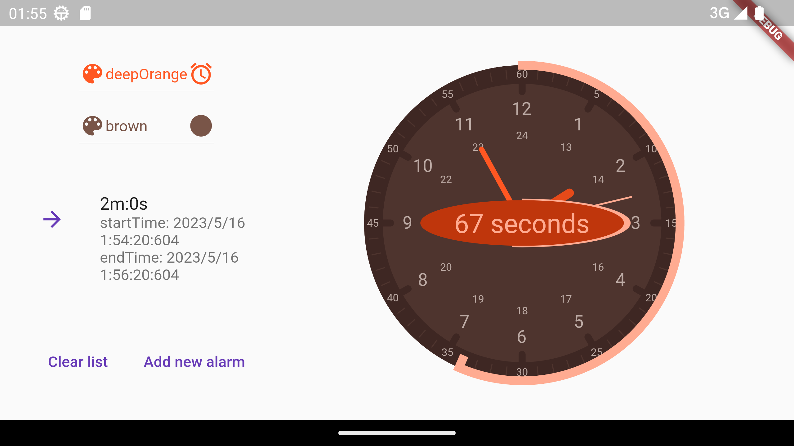
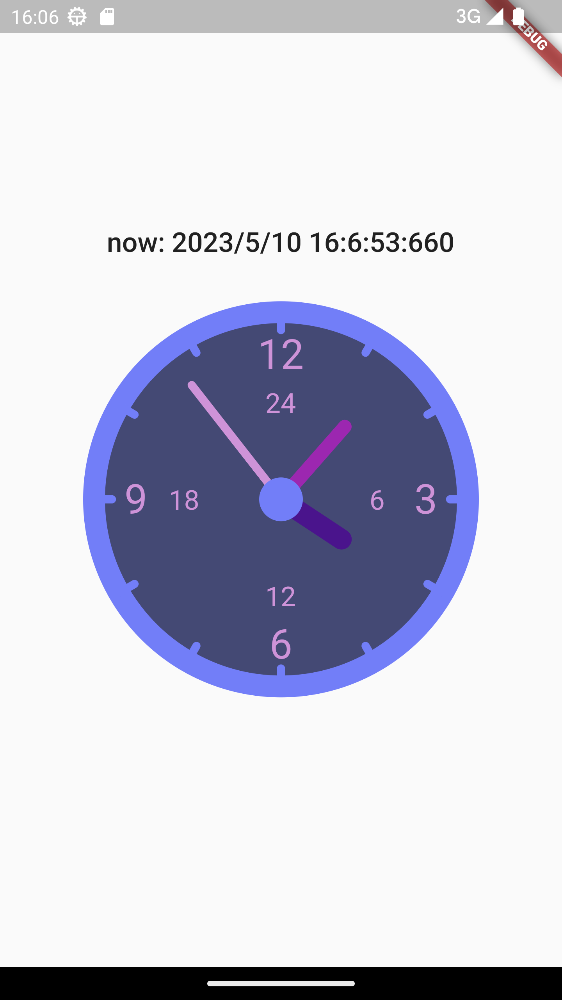

# pomodoro

A pomodoro application being developed with flutter to experiment with more low level graphics parts of the flutter engine

[Inspired by this tutorial](https://www.youtube.com/watch?v=HyAeZKWWuxA)

## New Horizontal UI 

## More Customization Implemented

## Initial prototype

